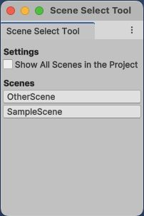

# Scene select tool
A simple little Unity Editor tool for quickly switching between scenes.

## How to install
Select one of the following methods:
1. From Unity package.<br/>Select latest release from the https://github.com/vcow/lib-scene-select-tool/releases and download __scene-select-tool.unitypackage__ from Assets section.
2. From Git URL.<br/>Go to __Package Manager__, press __+__ in the top left of window and select __Install package from git URL__. Enter the URL below:
```
https://github.com/vcow/lib-scene-select-tool.git#upm
```
&nbsp;&nbsp;&nbsp;&nbsp;&nbsp;&nbsp;&nbsp;&nbsp;or
```
https://github.com/vcow/lib-scene-select-tool.git#1.0.0
```
&nbsp;&nbsp;&nbsp;&nbsp;&nbsp;&nbsp;&nbsp;&nbsp;if you want to install exactly 1.0.0 version.
3. From OpenUPM.<br/>Go to __Edit -> Project Settings -> Package Manager__ and add next scoked registry:
* __Name__: package.openupm.com
* __URL__: https://package.openupm.com
* __Scope(s)__: com.vcow.scene-select-tool

&nbsp;&nbsp;&nbsp;&nbsp;&nbsp;&nbsp;&nbsp;&nbsp;Press __Save__, then go to __Package Manager__ and install __Scene Select Tool__ from the __My Registries -> package.openupm.com__ section.
4. Add to the ```manifest.json```.<br/>Open ```mainfest.json``` and add next string to the ```dependencies``` section:
```
{
  "dependencies": {
    "com.vcow.scene-select-tool": "https://github.com/vcow/lib-scene-select-tool.git#upm",
    ...
  }
}
```
&nbsp;&nbsp;&nbsp;&nbsp;&nbsp;&nbsp;&nbsp;&nbsp;or
```
{
  "dependencies": {
    "com.vcow.scene-select-tool": "https://github.com/vcow/lib-scene-select-tool.git#1.0.0",
    ...
  }
}
```
&nbsp;&nbsp;&nbsp;&nbsp;&nbsp;&nbsp;&nbsp;&nbsp;if you want to install exactly 1.0.0 version.

## How to use
Open tool __Tools -> Scene Select Tool__ and select scene from the list. You can dock this window for greater convenience.

